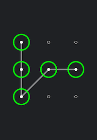
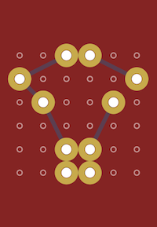
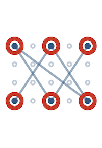

# CCGestureLock

CCGestureLock (Swift) is a customisable gesture/pattern lock for iOS written in Swift.


[](http://cocoapods.org/pods/CCGestureLock)
[](http://cocoapods.org/pods/CCGestureLock)
[](http://cocoapods.org/pods/CCGestureLock)

## Sample Screenshots

* Android / Iron Man / Captain America





## Example

To run the example project, clone the repo, and run `pod install` from the Example directory first.

## Requirements

N/A

## Installation

CCGestureLock is available through [CocoaPods](http://cocoapods.org). To install
it, simply add the following line to your Podfile:

```ruby
pod "CCGestureLock"
```

## Usage
### Adding Gesture Lock
* Add CCGestureLock instance to your view (OR, in Interface Builder, set an UIView's Custom Class to CCGestureLock).

### Logic Wire-Up
* Register event listener :
```Swift
gestureLock.addTarget(
    self,
    action: #selector(gestureComplete),
    for: .gestureComplete
)
```
* And handle event :
```Swift
func gestureComplete(gestureLock: CCGestureLock) {
    let lockSequence = gestureLock.lockSequence
}
```
* Managing states :
```Swift
// Set lock state to GestureLockState.error will highlight (user) selection sequence according appearance specified for "incorrect password" state
gestureLock.gestureLockState = .error

// Deselect selection sequence, enter reset state
gestureLock.gestureLockState = .normal
```

### Customisations
* Customise lock size:
```Swift
gestureLock.lockSize = (numHorizontalSensors: 3, numVerticalSensors: 3)
```
* Customise sensor appearance for states normal/selected/error(wrong password):
```Swift
// Sensor point customisation (normal)
gestureLock.setSensorAppearance(
    type: .inner,
    radius: 5,
    width: 1,
    color: .white,
    forState: .normal
)
gestureLock.setSensorAppearance(
    type: .outer,
    color: .clear,
    forState: .normal
)
        
// Sensor point customisation (selected)
gestureLock.setSensorAppearance(
    type: .inner,
    radius: 3,
    width: 5,
    color: .white,
    forState: .selected
)
gestureLock.setSensorAppearance(
    type: .outer,
    radius: 30,
    width: 5,
    color: .green,
    forState: .selected
)
        
// Sensor point customisation (wrong password)
gestureLock.setSensorAppearance(
    type: .inner,
    radius: 3,
    width: 5,
    color: .red,
    forState: .error
)
gestureLock.setSensorAppearance(
    type: .outer,
    radius: 30,
    width: 5,
    color: .red,
    forState: .error
)
```
* Customise line appearance for states normal/selected/error(wrong password):
```Swift
// Line connecting sensor points (normal/selected)
[CCGestureLock.GestureLockState.normal, CCGestureLock.GestureLockState.selected].forEach { (state) in
     gestureLock.setLineAppearance(
         width: 5.5,
         color: UIColor.white.withAlphaComponent(0.5),
         forState: state
     )
}
        
// Line connection sensor points (wrong password)
gestureLock.setLineAppearance(
    width: 5.5,
    color: UIColor.red.withAlphaComponent(0.5),
    forState: .error
)
```


## Author

Hsuan-Chih Chuang, <hsuanchih.chuang@gmail.com>

## License

CCGestureLock is available under the MIT license. See the LICENSE file for more info.
